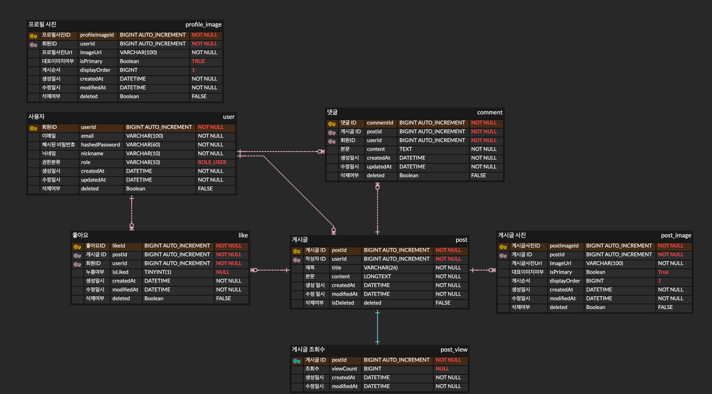

# 그나저나 (Backend)
주제를 바꿔 대화를 이어가는 말 '그나저나' 이곳에서 여러 주제의 대화를 끊임없이 이어가보세요!  

## 개요
**소셜 피드 백엔드. 로그인/회원가입, 게시글/댓글/좋아요, 프로필 편집**을 제공하는 개인 프로젝트입니다.
- 개발기간: 25.09.22 ~
- 개발인원: 1명

## 제공 기능
- 🔐 JWT 로그인/리프레시, 로그아웃
- 👤 프로필 조회·닉네임/비밀번호 변경, 프로필 이미지 업로드
- 📝 게시글 CRUD, 페이지네이션, 이미지 포함 업로드, 작성자만 수정/삭제
- 💬 댓글 CRUD, 작성자 권한 체크
- ❤️ 좋아요 추가/취소 및 카운트
- 📄 Swagger(OpenAPI) 문서화, 이메일/닉네임 중복 검사 API

## 기술 스택 (BE)
- Java 21, Spring Boot 3.5
- Spring Web, Spring Security, Validation
- Spring Data JPA + P6Spy, MySQL(Connector/J)
- JWT(JJWT) 기반 인증, Lombok
- Swagger/OpenAPI 3

## ERD

